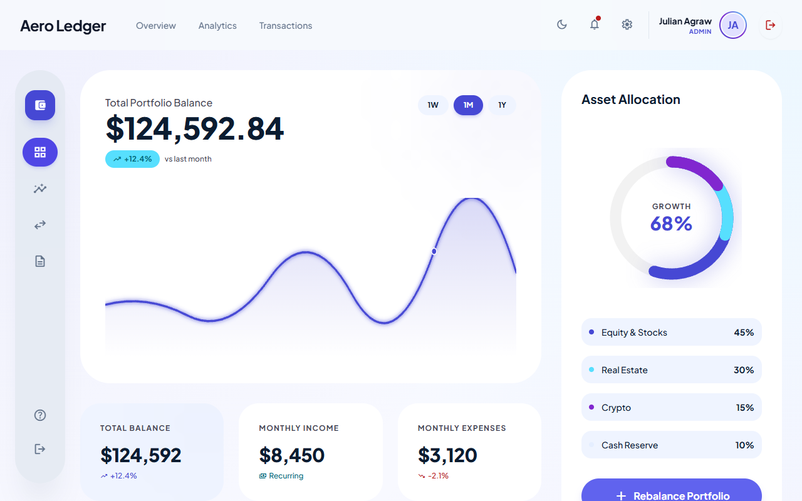
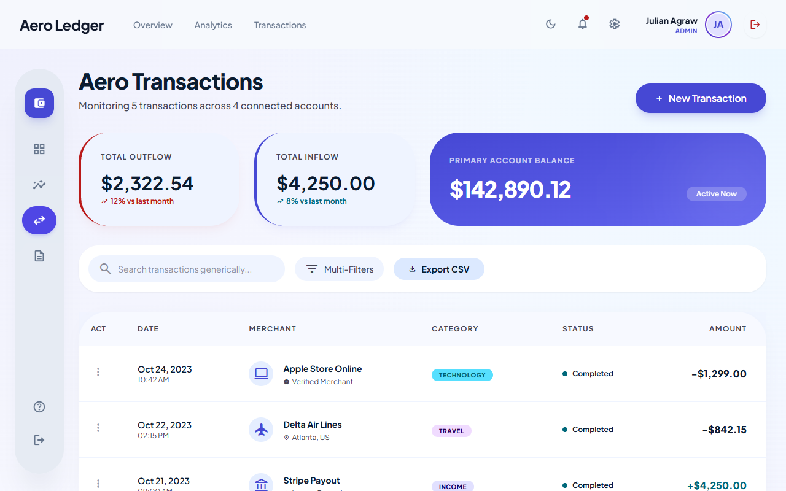
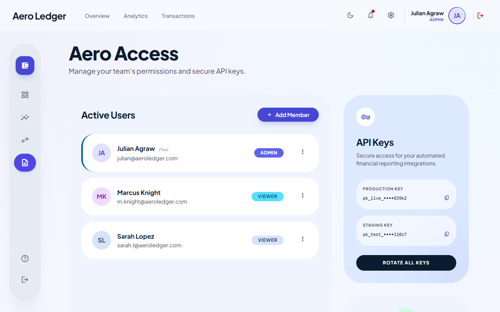

# Aero Ledger 🚀💸

A cutting-edge, responsive institutional fintech dashboard engineered with React, Vite, Tailwind CSS (v3), and Redux. Aero Ledger features a fully dynamic Role-Based Access Control (RBAC) system, interactive transaction filtering mapped to CSV logic, and a dynamic Typewriter Authentication gateway perfectly scaled for both desktop and mobile viewports.

---

## 🌟 Key Features

* **Advanced Authentication Gateway:** 
  * A full 2:3 ratio grid Hero Login Page featuring dynamic sweeping gradients.
  * Javascript Typewriter effects iterating rotating brand statements.
  * A Redux-bound profile selector dropdown that tracks the active user context across the app natively.
* **Role-Based Access Control (RBAC):**
  * Dashboard functionally protected against routing until securely authenticated (`isAuthenticated: true`).
  * "Access Page" strictly locks modification commands (Add Member, Edit, Delete) behind `Admin` session boundaries securely evaluated via Redux.
* **Transaction Tracking Engine:**
  * Complex filtering layers tracking Search queries, strict range boundaries (e.g. `Income <= $X`), and transaction statuses.
  * **Export to CSV:** Direct client-side `blob` creation securely extracting mapped transaction data into native Excel spreadsheets.
* **Next-Gen Aesthetics:**
  * Flawless Dark Mode context toggler that fluidly inverts chart grids, typography mapping, and dynamic bounding boxes.
  * Advanced Glassmorphism and Backdrop-Blur styling using Stitch AI derived custom Tailwind themes.
  * Fully Mobile-First fluid design architecture preventing horizontal clipping natively formatting tables correctly across devices.

---

## 📸 Visual Gallery

### 1. Light Mode (Overview & Analytics)


### 2. Transaction Logging & Filtering


### 3. RBAC Access Control Modal


---

## 🛠️ Technology Stack

* **Core:** React 18, Vite (HMR)
* **Styling:** Tailwind CSS v3, CSS Vectors
* **State Management:** Redux Toolkit (`userSlice`, `transactionsSlice`) bound via dynamic LocalStorage caching.
* **Routing:** `react-router-dom` guarded effectively for auth barriers.
* **Icons:** Google Material Symbols (Rounded)

---

## 🚀 Getting Started

### Prerequisites
Make sure you have [Node.js](https://nodejs.org/) installed on your machine.

### Installation

1. **Clone the repository** (if fetched via source control) or extract the `.zip`.
```bash
git clone https://github.com/Bhavesh42833/Fintech-Dashboard.git
cd Fintech-Dashboard
```

2. **Install the dependencies**:
```bash
npm install
```

3. **Start the Development Server**:
```bash
npm run dev
```

4. **Boot up:** Open your browser and navigate automatically to `http://localhost:5173`. You will instantly be faced with the protective Login layer. Click the Profile box, swap to an `Admin` or `Viewer` payload, and hit the arrow to enter the app!

---

## 📂 Project Architecture

```plaintext
/src
  /components      # Reusable functional UI components (Modals, Headers, Sidebar)
  /constants       # Global configuration files (Theme tokens)
  /context         # Global lightweight hooks (ThemeContext)
  /pages           # Core Page Views (Login, Overview, Transactions, Access)
  /store           # Redux logic slices (`userSlice.js`, `transactionsSlice.js`)
  App.jsx          # Protected React Router constraints
  main.jsx         # DOM Redux wrapped Injection layer
  index.css        # Core custom Glassmorphic utilities and CSS overwrites
```

---

<br>
<p align="center">
  <i>Developed dynamically scaling mobile-first principles with 💙.</i>
</p>
